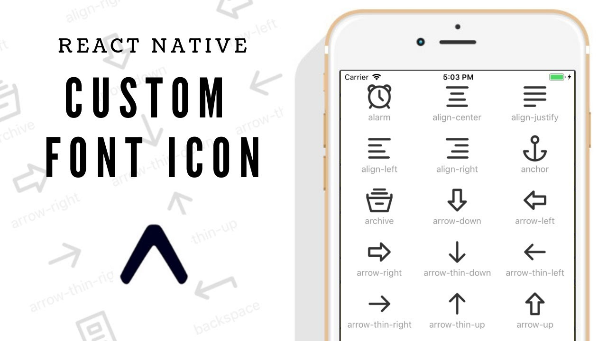
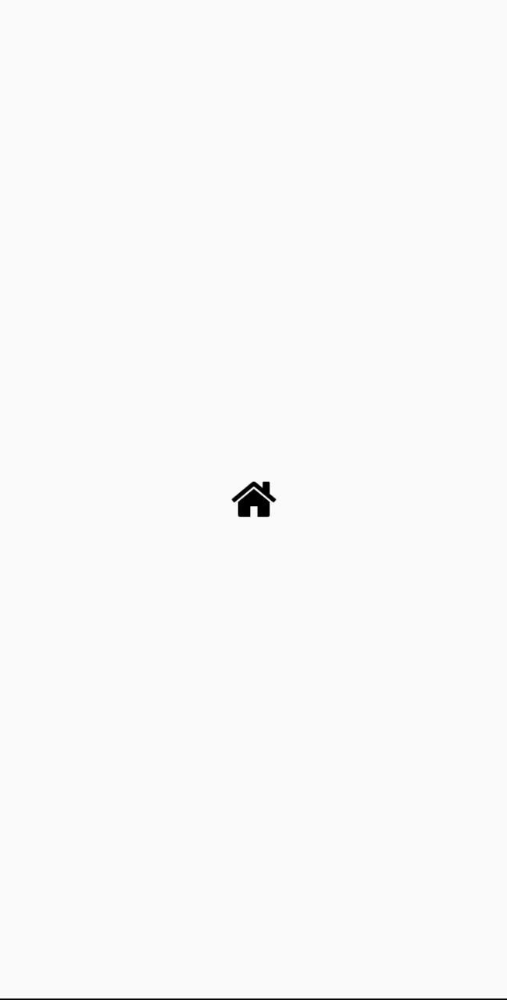

## Utilizando ícones no React Native 
<p align="center">
  
</p>


<p>Acho que hoje não existe uma aplicação sequer que não utilize algum tipo de ícone. No React Native não é diferente.</p>
<p>Então mão na massa!!!</p> 

---

### Para utilizar os pacotes de icone

<p>Para utilizar os pacotes de fontes no React Native vamos utilizar a biblioteca react-native-vector-icons. Vamos começar instalando a biblioteca no projeto:</p>

``` yarn add react-native-vector-icons ```

<p>Agora com a lib instalada podemos realizar o link da biblioteca com o código nativo com o comando:</p>

``` react-native link  ```

<p><b>Reinicie seu emulador</b> e agora em qualquer componente você pode utilizar o pacote de fontes que preferir utilizando o componente <b>Icon</b></p>

```
import React from 'react';
import { View, StyleSheet } from 'react-native';
import  Icon  from 'react-native-vector-icons/FontAwesome';

export default function App() {
 return (
    <View style={styles.container}>
      <Icon name="home" size={40} color="#000"/>
    </View>
 );
}

const styles = StyleSheet.create({
  container: {
    flex: 1,
    justifyContent: 'center',
    alignItems: 'center',
  }
}) />
 ```
 ---
 ### Pronto!

 <p>Agora você já pode utilizar os ícones de vários pacotes de fontes da internet, este que citei foi apenas um exemplo. </p>
 
 

 <p>Citarei mais um, onde vamos ver que é possível colocar icones em botões, na verdade é só mais um exemplo para dai inicio a sua criatividade. </p>


 <Vou>Se você quer saber quais ícones pode utilizar, o próprio site da biblioteca oferece uma opção de busca em todos pacotes possíveis, vou deixar abaixo links da documentação onde tem todas as bibliotecas.</p>

 ---

 ### Documentação Icons

 - ​Link da documentação:

 [Clik aqui](https://github.com/oblador/react-native-vector-icons)

 - Veja todos os icones:

[Click aqui](https://oblador.github.io/react-native-vector-icons/)

 ---

 ### O Projeto 

 <p>Este projeto foi desenvolvido afim de criar habilidade com <b>Icons</b> e conhecer sua biblioteca, eu achei tão incrivel que decidi compartilhar, espero que tenha te ajudado como me ajudou a dar inicios nas pesquisas, pois somando todos os pacotes que a biblioteca tem deve possuir mais o menos <b>10 Mil Icons.</b></p>


